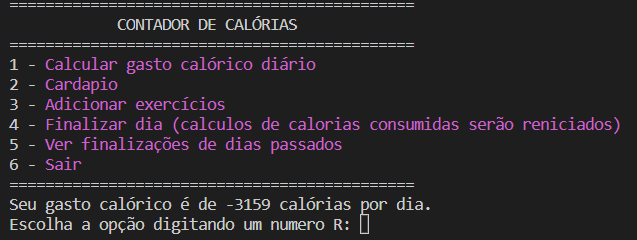

# Cálculo de Calórias
icone:
 
  

# Sumário

* [Sobre](#Sobre)
* [Como usar](#Como-usar)
    * [Pré-Requisitos](#pré-requistos)
    * [Funcionamento](#funcionamento)
* [informações finais](#informações-extras-do-projeto)
    * [Status do Projeto](#Status)
    * [Tecnologias usadas](#🛠-tecnologias)
    * [Autor do projeto](#autor-do-projeto-e-contato)

# Sobre
Esse Script é feito para contar as calórias que são gasta e consumidas durante o dia, com inteção de auxiliar o controle de consumo de alimentos usando as funções do menu que estão dísponivel no programa.  Utilizando banco de dados MYSQL, o programa faz tabelas de alimentos que normalmente são consumidos pelo usuário, cálculos de gasto calórios diário e anotação do resultado da finalização de dias separado por datas.

# Como usar
### Pré-requistos:
* Uma conexão de banco de dados MYSQL

* Será nessesário o Python também.

### Funcionamento:

1. Na primeira execução, será obrigatório você passar os dados da sua conexão MYSQL (Localhost, User e Password) e dados pessoas (sexo, idade e peso), para ter acesso ao menu principal.

2. depois de dar as informações necessárias para dar continuidade a execução, o menu será exibido.

      
        Você vai escolher as opções do menu digitando o numero da opção desejada.
         
        Exemplo: Se você quer ver as finalizações de dias passados, digite 5 e aperte enter.

# Informações extras do projeto

### Status do projeto:
* 🚧 Em construção... Entre em contato para denunciar possíveis bugs 🚧

### 🛠 Tecnologias:
* Python 3.10
* MySQL Server 8.0.27

### Autor do projeto e contato:
* Nome: Matheus Marinho
* Formação: Cursando Ciências da Computação (2° semestre)
* Contatos: [GitHub](https://github.com/purplecod) - [linkedin](https://www.linkedin.com/in/matheus-marinho-522371219/)

